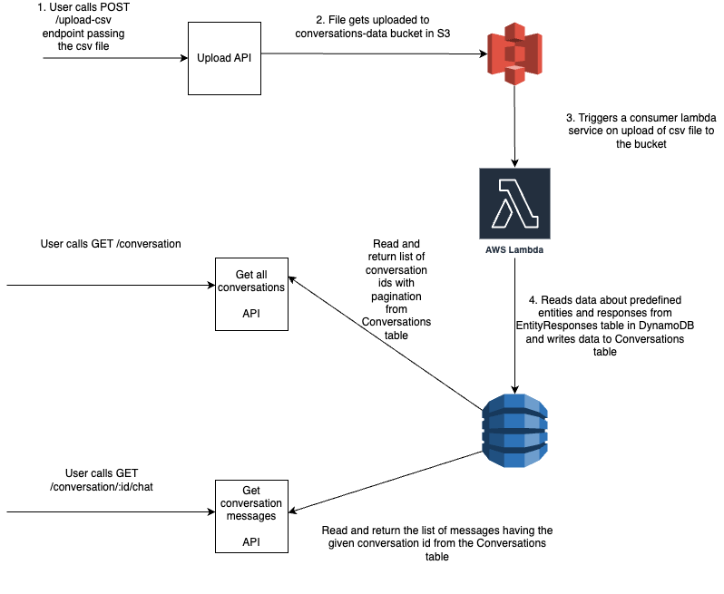
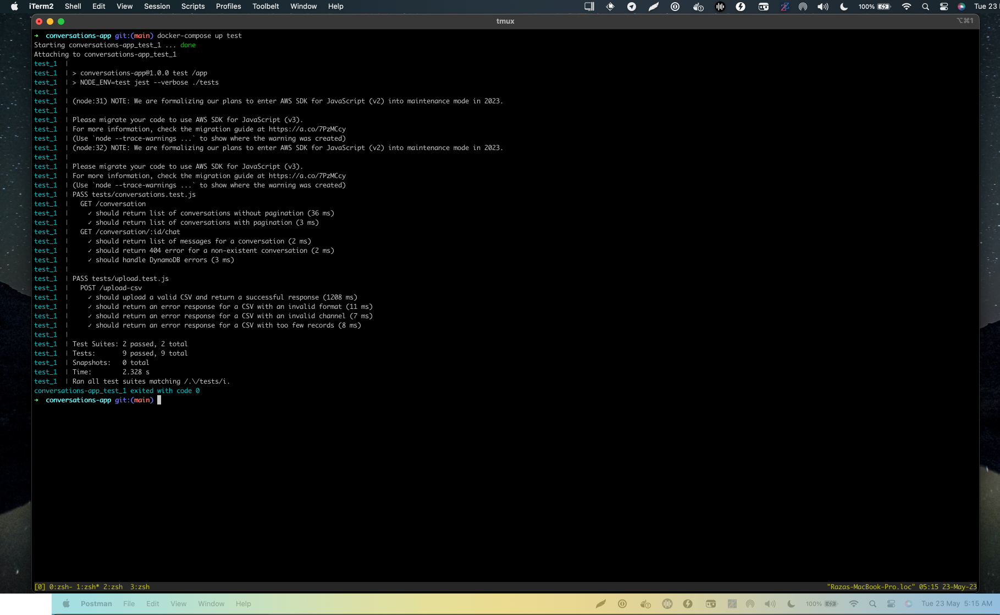

# Conversations App

The Conversations App is a set of RESTful API's that allows users to manage and view conversations and messages. It provides endpoints to upload conversations from a CSV file, retrieve a list of conversations, and retrieve messages within a conversation.

## Features

- Upload conversations from a CSV file.
- Get a list of conversations with pagination support.
- Get messages within a conversation with pagination support.
- Error handling for invalid CSV formats, missing fields etc.

## Tech Stack

- ExpressJS: A fast and minimalist web application framework for Node.js.
- AWS: Amazon Web Services, providing cloud-based services for storage, database, and more.
- Docker: A containerization platform for building, packaging, and deploying applications.
- Jest: A JavaScript testing framework for writing unit tests.
- Supertest: A library for testing Node.js HTTP servers.
- Mock-fs: A library for mocking the file system in Node.js tests.
- aws-sdk-mock: A library for mocking AWS SDK services in Node.js tests.
- Postman: A collaboration platform for API development and testing. I have included the Postman collection as part of the project repo.

## Prerequisites

- Docker
- Docker Compose
- Amazon Web Services (AWS) account. Im using my AWS Free Tier credentials for this app. Since this is a technical challenge project i
have created a temporary AWS access key and secret access key which i have stored in a `.env` file in the project root as it will be required for running the application locally.

## Application Architecture



As per the above diagram the following AWS services have been used:

1. S3 to store the uploaded csv file.

2. Lambda which is a consumer service that gets triggered on upload of csv file to the S3 bucket.

3. DynamoDB for storage. This consists of two tables: 

    a. `EntityResponses` which contains predefined values for different entities and their corresponding responses.

    b. `Conversations` which holds the data from the uploaded csv as well as autogenerated responses based on information from the EntityResponses table.

## Running the app

```
docker-compose up app
```

## Stop the running app

```
docker-compose stop
```

## Running the unit tests

```
docker-compose up test
```

Below is the screenshot of successful passing of all the unit tests.



## Testing the API endpoints

First start the app using:

```
docker-compose up app
```

Then use Postman or any other API testing tool to interact with the Conversations App endpoints.


## API Documentation

There are 3 API endpoints:

1. `POST /upload-csv` - To upload a CSV file.

2. `GET /conversation` - To get a list of conversation ids with pagination.

3. `GET /conversation/:id/chat` - To get a list of messages in the given conversation id with pagination.

The detailed documentation of each endpoint is as follows:


1. `POST /upload-csv`

This endpoint is used to upload a CSV file. The endpoint expects a single file under the key 'file'.

#### Parameters

No parameters are required.

#### Body

Multipart form data with the following structure:

| Name  | Type   | Description                      |
|-------|--------|----------------------------------|
| file  | binary | The CSV file to be uploaded.     |

### CSV File Structure

The CSV file must have the following structure:

| sender_username | receiver_username | message | channel |
|-----------------|-------------------|---------|---------|
| String          | String            | String  | String  |

### Response

Success:

`200 OK`

```json
{
    "message": "File uploaded successfully to S3 bucket YOUR_BUCKET_NAME"
}
```

Failure:

`400 Bad Request`

If CSV file does not contain exactly the required number of records. The application requirement was for 1000 records but in 
my case i have set it to 23 in `config.js` to have a manageable number of records to work with.

```json
{
    "error": "CSV file should contain exactly REQUIRED_NUMBER_OF_RECORDS records"
}
```

If CSV file has an invalid format.

```json
{
    "error": "Invalid CSV format: RECORD_STRUCTURE"
}
```

If CSV file contains an invalid channel.

```json
{
    "error": "Invalid channel in CSV record: CHANNEL_NAME"
}
```

2. `GET /conversation`

This endpoint is used to retrieve conversations from a DynamoDB table.

#### Query Parameters

| Name     | Type    | Description                                               | Default | Optional |
|----------|---------|-----------------------------------------------------------|---------|----------|
| limit    | Integer | The number of conversations to return in a single request | 10      | True     |
| startKey | String  | The primary key of the first item that this operation will evaluate | None  | True     |

The `startKey` should be a stringified JSON object that corresponds to the DynamoDB primary key. This is used for pagination.

### Response

Returns a list of conversation ids 10 at a time.

Success:

`200 OK`

```json
{
    "conversations": [
        "36a1bb079250343a777026420d80f8ff3442999667cb4125c37d5e7662a7d3fd",
        "22a7a772ddbe929126004001dcbf185439a6f834e74b93a7bf8cdf528d79f68e",
        "783a6764f4665f4521ceacda2bc72b3ee7d1df00261ba3b7e13a1a6b52b3492c",
        "aee6fb0934c2d7d1be5dc506dcf983f349d7b81d244236b7c7165bf552153f45",
        "756248ee5735c80d1a45a76707f2e65cd287eb7acfb6a074b9a141f1fd0d9d92",
        "14474b11faf5301596996082f5946aeac8296b1724154dadd284f53f21eb38aa",
        "957546d11ee9e7e1a42a2b54c8840927077791b6bb9d3ec0c3cf461dfc72de93",
        "51a1d0026b7f92059d7d8913e6b4d838d721745f78b0e8c0bec09bb11a6a9047",
        "4b20ddec0687ea18f83622fab0482c67fcaa22ce7ccd375e5d2f1d8a093d46ee",
        "01ef80a190352bc84055aa7d06f64c177ed497903b2ffb7eaace269727253929"
    ],
    "startKey": "{\"messageId\":\"6baf041de7af4378fc45f2b8b7e268421ae68045eff6869fb07c44cc1dec99fa\",\"conversationId\":\"01ef80a190352bc84055aa7d06f64c177ed497903b2ffb7eaace269727253929\"}"
}
```

This returns a paginated set of conversation ids. To get the next set of 10 conversations send a GET request to the following URL:

`GET /conversation?startKey={"messageId":"6baf041de7af4378fc45f2b8b7e268421ae68045eff6869fb07c44cc1dec99fa","conversationId":"01ef80a190352bc84055aa7d06f64c177ed497903b2ffb7eaace269727253929"}`

3. `GET /conversation/:id/chat`

This endpoint is used to retrieve chat messages for a specific conversation from a DynamoDB table.

#### Path Parameters

| Name | Type   | Description                   | Optional |
|------|--------|-------------------------------|----------|
| id   | String | The ID of the conversation.   | False    |

#### Query Parameters

| Name     | Type    | Description                                               | Default | Optional |
|----------|---------|-----------------------------------------------------------|---------|----------|
| limit    | Integer | The number of messages to return in a single request.     | 10      | True     |
| startKey | String  | The primary key of the first item that this operation will evaluate. | None  | True     |

The `startKey` should be a stringified JSON object that corresponds to the DynamoDB primary key. This is used for pagination.

### Response

Success:

`200 OK`

```json
{
    "messages": [
        {
            "sourceMessage": "Hey I'm interested in the latest discounts and promotions. Can you share any ongoing offers?",
            "receiverUsername": "@gracethomas",
            "messageId": "1fdbbb917efa6965844aa7a968591e0c52cd3bb69bfc8f2005bfe27346c0c302",
            "timestamp": "2023-05-22T23:10:56.385Z",
            "responseMessage": "Hey @jessicathomas, we love rewarding our followers with special discounts and promotions. Make sure to follow us on Instagram to stay in the loop and take advantage of our exciting offers.",
            "conversationId": "36a1bb079250343a777026420d80f8ff3442999667cb4125c37d5e7662a7d3fd",
            "senderUsername": "@jessicathomas",
            "channel": "instagram"
        }
    ]
}
```

## Video Recording of using the app:

I have created a video recording of me running the application using Awesome Screenshot which can be viewed at [https://www.awesomescreenshot.com/video/17637539?key=19d680cb6119f317a5863e327ccc113b](https://www.awesomescreenshot.com/video/17637539?key=19d680cb6119f317a5863e327ccc113b)


